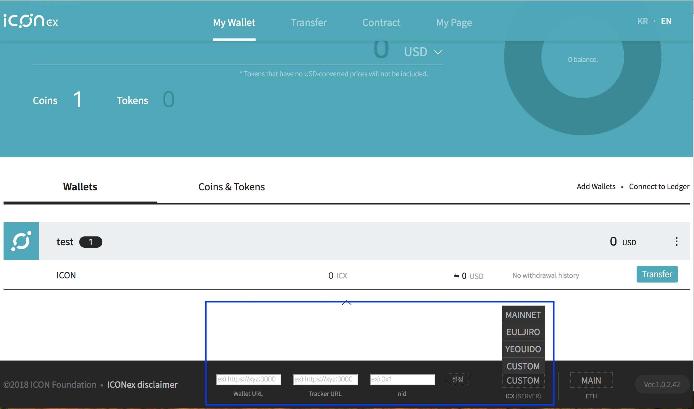

# Réseau d'ICON

Lorsque vous basculez entre les différents réseaux, veillez à être sûr d'utiliser le bon identifiant de réseau (*network id*).
Si l'identifiant de réseau ne correspond pas, les transactions échoueront.

## Devnet privé sur AWS 
- TBA

## Testnet pour les DApps

Veuillez noter que le testnet courant peut être réinitialisé à zéro à tout moment, et vous pouvez être confronté à des indisponibilités imprévues.
Nous travaillons sur un environnement de test final plus stable accompagné de plusieurs réseaux pour faire des tests.

|              |                |
|--------------|----------------|
| Nom          | Yeouido (여의도) |
| Noeud         | https://bicon.net.solidwallet.io |
| Point d'accès de l'API | https://bicon.net.solidwallet.io/api/v3 |
| Network ID (nid) | 3 |
| Tracker         | https://bicon.tracker.solidwallet.io |
| Frais de transaction | Activé |
| Audit de SCORE     | Désactivé |

Pour recevoir des ICX sur le testnet, merci d'envoyer un email à `testicx@icon.foundation` avec les informations suivantes.
- URL du nœud testnet
- Addresse de réception des ICX de testnet. Il s'agit d'une chaîne de caractères débutant par `hx`.

## Testnet pour les échanges
Le réseau Euljiro est exclusivement ouvert pour les développeurs des échanges.

|              |                |
|--------------|----------------|
| Nom         | Euljiro (을지로) |
| Noeud         | https://test-ctz.solidwallet.io |
| Point d'accès de l'API | https://test-ctz.solidwallet.io/api/v3 |
| Network ID (nid)| 2 |
| Tracker         | https://trackerdev.icon.foundation |
| Frais de transaction | Activé  |
| Audit de SCORE     | Activé |

Pour recevoir des ICX de test, merci de contacter votre gérant de compte.

## Mainnet

|              |                |
|--------------|----------------|
| Nom         | ICON Mainnet   |
| Noeud         | https://ctz.solidwallet.io |
| Point d'accès de l'API | https://ctz.solidwallet.io/api/v3 |
| Network ID (nid)| 1 |
| Tracker         | https://tracker.icon.foundation |
| Frais de transaction | Activé  |
| Audit de SCORE     | Activé  |

Avant de soumettre votre SCORE au réseau principal d'ICON, vous devez le tester entièrement à l'aide de T-Bears et du testnet.
Notez que l'audit du SCORE n'est pas activé sur le testnet. Veuillez être sûr que vous comprenez la politique d'audit d'ICON et de suivre les règles.
  - [Audit de SCORE](score_audit-fr.md)
  - [Liste de choses à vérifier](audit_checklist-fr.md)
  - [Guide de déploiement](score_deploy_guide-fr.md)

Si vous avez la moindre question à propos du processus de l'audit, merci d'envoyer à mail à `audit@icon.foundation`.

## Comment changer de réseau dans l'extension Chrome ICONex
- Ouvrez les outils de développement de Chrome en appuyant sur F12, puis allez dans l'onglet **Application**. Dans la section **Storage**, déroulez **Local Storage**.
- Ajoutez une nouvelle pair clé/valeur, **isDev/true**, en cliquant dans la ligne vide en bas de la table.

- Rechargez votre portefeuille, et vous verrez un menu en bas. Cliquez sur le bouton **ICX (SERVER)** afin d'ouvrir une liste déroulante des réseaux disponibles.
Vous pouvez en choisir un prédéfini, ou définir manuellement votre noeud.

---
[Document de référence](https://github.com/icon-project/icon-project.github.io/tree/3c4d77ced348bc5ea801eb61f55b5ac79e805ebd)
