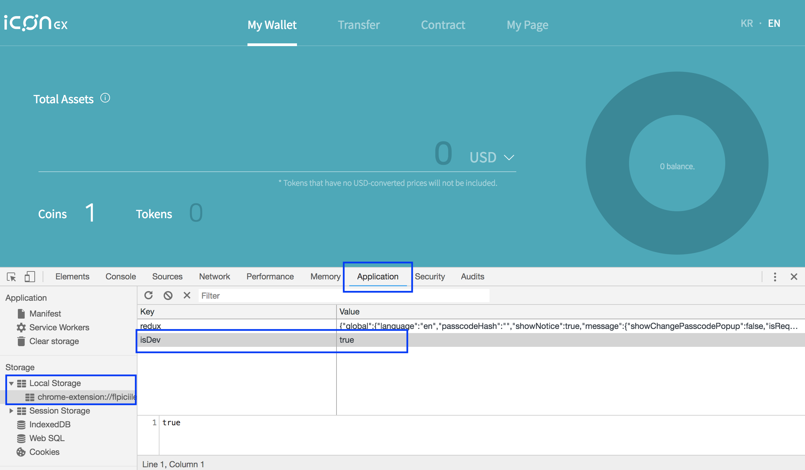
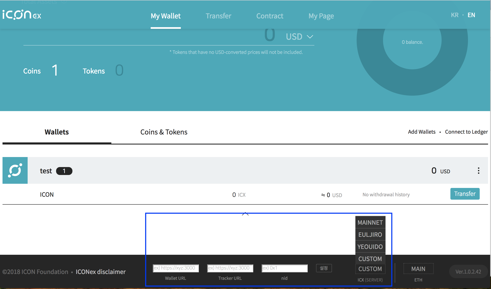

# ICON Network
When you switch between networks, make sure you use the correct network id.
If the network id does not match, transaction will fail.  

## Private Devnet on AWS
- TBA

## Testnet for DApps

Please note that current testnet can be reset anytime, and you may experience unexpected downtime.
We are working on preparing a more stable final test environment
along with less-managed multiple playground networks.  

|              |                |
|--------------|----------------|
| Name         | Yeouido (여의도) |
| Node         | https://bicon.net.solidwallet.io |
| API endpoint | https://bicon.net.solidwallet.io/api/v3 |
| Network ID (nid)| 3 |
| Tracker         | https://bicon.tracker.solidwallet.io |
| Transaction fee | on  |
| SCORE audit     | off |

To receive test ICX, please send email to `testicx@icon.foundation` with following information.
- Testnet node url
- Address to receive the testnet ICX. Address should start with `hx` followed by 20 byte string.

## Testnet for Exchanges
Euljiro network is exclusively open to the exchange developers. 

|              |                |
|--------------|----------------|
| Name         | Euljiro (을지로) |
| Node         | https://test-ctz.solidwallet.io |
| API endpoint | https://test-ctz.solidwallet.io/api/v3 |
| Network ID (nid)| 2 |
| Tracker         | https://trackerdev.icon.foundation |
| Transaction fee | on  |
| SCORE audit     | on  |

To receive test ICX, please send email to `testicx@icon.foundation` with following information.
- Testnet node url
- Address to receive the testnet ICX. Address should start with `hx` followed by 20 byte string.

## Mainnet

|              |                |
|--------------|----------------|
| Name         | ICON Mainnet   |
| Node         | https://ctz.solidwallet.io |
| API endpoint | https://ctz.solidwallet.io/api/v3 |
| Network ID (nid)| 1 |
| Tracker         | https://tracker.icon.foundation |
| Transaction fee | on  |
| SCORE audit     | on  |

Before you submit your SCORE to the ICON mainnet, you should test thoroughly on T-Bears and testnet.
Note that SCORE audit is not enabled in testnet. Please make sure you understand the ICON audit policy and follow the guidelines.
- [SCORE Audit](score_audit.md)
- [Audit Checklist](audit_checklist.md)
- [Deploy Guideline](score_deploy_guide.md)
  
If you have any questions about the audit process, please send email to `audit@icon.foundation`.

## How to change network in ICONex Chrome extension
- Open the Chrome DevTools by pressing F12, then go to the **Application** tab. In the **Storage** section, expand **Local Storage**. 
- Add a new key/value pair, **isDev/true**, by clicking on the empty row at the bottom of the table.

- Reload your wallet, then you will see the menu in the bottom. Click the **ICX (SERVER)** button to open the dropup list of the available networks. You can choose predefined one, or manually set a custom node. 

 
