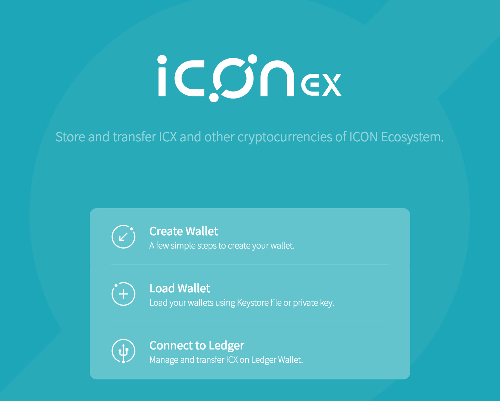
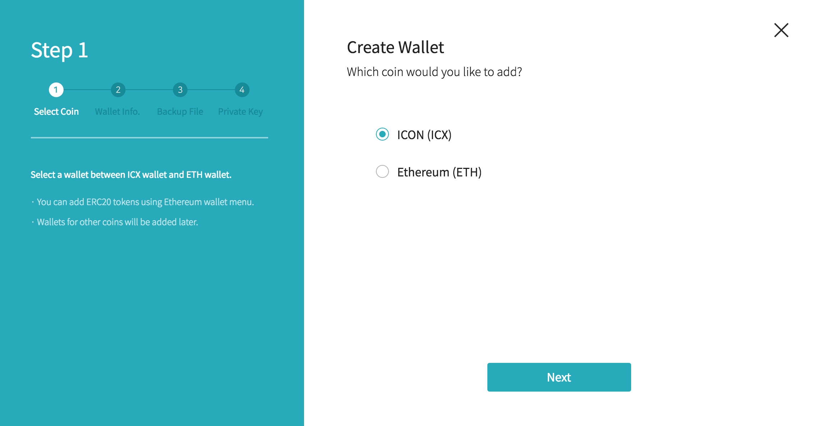
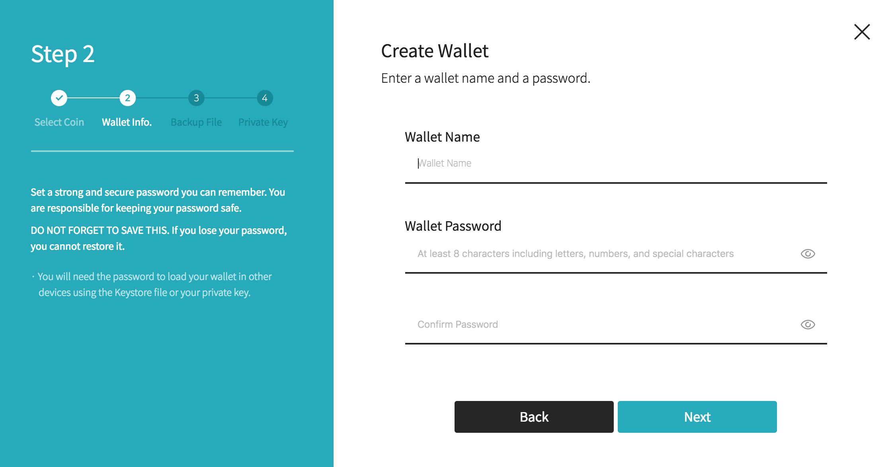
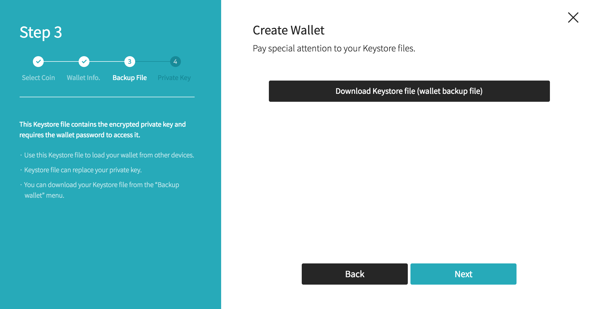
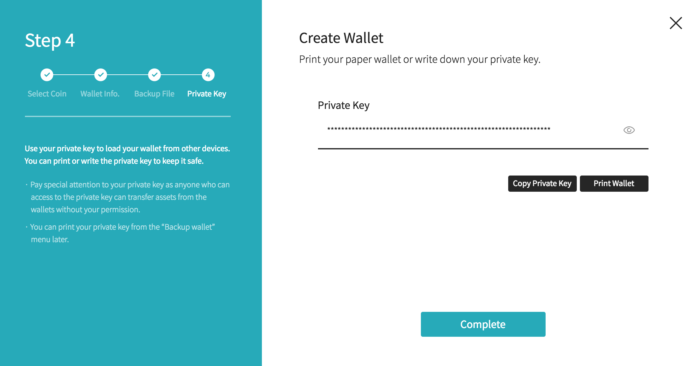

Gestion du compte
==============

## Compte
Il y a deux types de comptes sur ICON, les comptes associés avec les utilisateurs, souvent nommés les *Externally Owned Accounts* (EOA), et les *Smart Contract (SCORE) Accounts*. Une addresse EOA commence par "hx" suivi par une chaîne de caractère hexadécimale de 20 octets, tandis que l'adresse d'un compte d'un Smart Contract commence par "cx" suivi par une chaîne de caractère hexadécimale de 20 octets.

Afin de déployer un SCORE sur le réseau d'ICON ou pour créer une transaction, on doit détenir un EOA valide. De plus, lorsqu'on parle de compte dans ce document, on parle d'EOA. Les termes comme EOA, portefeuille et keystore ne sont pas exactement les mêmes, mais souvent utilisés de manière interchangeable.

Un compte est définit cryptographiquement par sa paire de clés privée-publique, et l'adresse du compte peut être dérivée depuis sa clé publique. Créer un compte est équivalent à créer cette paire de clé, et ce compte peut être exporté dans un fichier, c'est à dire le fichier du keystore.

## Fichier du keystore
Le fichier du keystore est un fichier texte en JSON qui contient votre clé privée et une adresse. La clé privée est chiffrée avec un mot de passe que vous entrez lorsque vous créez un compte ou un fichier de keystore. Si vous perdez votre keystore et votre mot de passe, il n'y a aucune moyen de les récupérer. Vous perdrez votre compte et les actifs possédés dessus.

Le fichier keystore est utilisé pour authentifier un utilisateur. Chaque transaction doit être signée avec votre clé privée. Si votre clé privée est révélée publiquement, n'importe qui possédant la clé privée peut accéder à votre compte et signer la transaction à votre place. Ainsi, il est toujours conseillé d'utiliser un keystore au lieu d'une clé privée non chiffrée.

## Créer un compte
Il y a plusieurs façons de créer un compte.

### En utilisant T-Bears
Vous pouvez créer un keystore depuis la ligne de commande en utilisant la commande `tbears keystore`.

``` bash
$ tbears keystore [keystore_file_name]
Input your keystore password : 
Retype your keystore password : 

Made keystore file successfully
```

### En utilisant le SDK Python
#### Créer un compte
KeyWallet est un objet représentant votre compte. Le code ci-dessous créé une nouvelle instance de KeyWallet. En interne, la paire de clés privée-publique est générée.

```python
wallet = KeyWallet.create()
```

#### Charger un compte existant
```python
# Charger un compte existant en utilisant une clé privée
key = bytes.fromhex(userPrivateKey)
wallet = KeyWallet.load(key)

# Charger un compte existant en utilisant un keystore
wallet = KeyWallet.load(keystoreFilePath, password)
```
#### Exporter un keystore
```python
wallet.store(destinationFilePath, password)
```

### En utilisant le SDK Java
#### Créer un compte
```java
KeyWallet wallet = KeyWallet.create()
```
#### Charger un compte existant
```java
// Charger un compte existant en utilisant une clé privée
Bytes key = new Bytes(userPrivateKey)
KeyWallet wallet1 = KeyWallet.load(key);

// Charger un compte existant en utilisant un keystore
File file = new File(destinationDirectory, filename);
KeyWallet wallet2 = KeyWallet.load(password, file);
```
#### Exporter un keystore
```java
// Chemin de sauvegarde du keystore. Le nom du fichier du keystore est généré automatiquement.
File destinationDirectory = new File("./"); 

// Mot de passe du keystore
String password = "password_string"; 

String fileName = KeyWallet.store(wallet, password, destinationDirectory);
```

### En utilisant ICONex
ICONex est une application sous la forme d'une extension de Chrome. [Installer ICONex](https://chrome.google.com/webstore/detail/iconex/flpiciilemghbmfalicajoolhkkenfel)

#### Créer une compte et télécharger le fichier du keystore
1. Cliquez sur "Create Wallet". 


2. Selectionnez "ICON (ICX)"


3. Entrez le nom du portefeuille et un mot de passe.


4. Téléchargez et gardez une copie du fichier du keystore.


5. Confirmez votre clé privée et gardez-la en sécurité.



#### Charger un compte existant

1. Cliquez sur "Load Wallet"

2. Vous pouvez charger votre compte depuis un keystore ("Select wallet file") ou utiliser une clé privée ("Enter Private Key").

---
[Document de référence](https://github.com/icon-project/icon-project.github.io/tree/25c1ad06172e2a58d06da35efbfab85c030d28d2)
